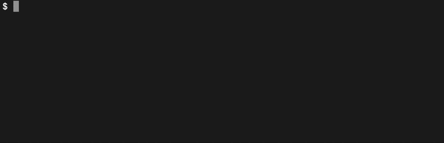

# 👮 DepsCop

DepsCop is a dependency management tool that helps enforce rules and restrictions on your project's dependencies. It acts as a whitelist system for your `package.json` dependencies, controlling which packages can be used and ensuring that your project maintains consistent and secure dependency versions.



## Table of Contents

- [Features](#features)
- [Installation](#installation)
- [Usage](#usage)
- [Rulesets](#rulesets)
- [Configuration](#configuration)
- [Command Line Interface](#command-line-interface)
- [Exit Codes](#exit-codes)
- [Example Configuration](#example-configuration)
- [Requirements](#requirements)
- [Contributing](#contributing)
- [License](#license)

## Features

- **Package Blocking**: Block specific versions or all versions of packages ([`forbidden` ruleset](#forbidden))
- **Version Recency**: Enforce using recent versions of packages ([`recent` ruleset](#recent))
- **Version Range**: Enforce specific semver patterns ([`semver` ruleset](#semver))

## Installation

```bash
npm install deps-cop --save-dev
```

## Usage

```bash
npx depscop
```

## Rulesets

DepsCop provides three types of rulesets that help you control and manage your project's dependencies. A dependency can be specified in one or multiple rulesets.

A dependency can be specified in multiple rulesets and can have multiple rules within each ruleset. Each rule must include a custom message that explains why the rule exists, helping your team understand the reasoning behind dependency restrictions.

### Forbidden

Rules that prevent the use of specific package versions or entire packages. Package versions that satisfy the specified semver patterns are considered **invalid**.

```json
{
  "forbidden": {
    "lodash": ["any", "Use lodash-es instead for better tree-shaking"],
    "some-package": [
      ["<4.5.0", "Versions below 4.5.0 have critical bugs"],
      [">=5.0.0", "Versions >=5 require migration of our codebase"]
    ],
    "some-ui-kit": [
      "7.3.0",
      "This version contains security vulnerabilities. Please use another version instead"
    ]
  }
}
```

- Uses standard semver syntax (e.g., `^`, `~`, `>`, `<`, `>=`, `<=`)
- Use `"any"` as the version to block all versions of a package
- Multiple rules per package are supported
- Rules are evaluated in order

### Recent

Rules that enforce using recent versions of packages using a custom version syntax.

```json
{
  "recent": {
    "eslint": [
      "9.-3",
      "Keep ESLint within last 3 minor versions for stability"
    ],
    "some-ui-kit": [
      [
        "-1.-2.-2",
        "Keep UI-kit within last 2 minor versions and last 2 patch versions for UI consistency"
      ]
    ]
  }
}
```

Version syntax:

- Format: `[major].[minor].[patch]` where:
  - Any part can be a negative number, meaning "last N versions" for that part
  - Not all parts are required:
    - `"-1"` - any version of the latest major version
    - `"8.-1"` - any patch version of major version 8 with last minor version
    - `"8.-1.-1"` - exactly the latest patch of the latest minor of major version 8
  - Examples:
    - `"8.-3"` means "last 3 minor versions of major version 8"
    - `"8.-3.0"` means "last 3 minor versions of major version 8 with patch 0"
    - `"8.0.-3"` means "last 3 patch versions of major version 8 with minor 0"
    - `"-1.-1.-1"` means "latest version available"
- Multiple rules per package are supported
- Rules are evaluated in order

### Semver

Rules that enforce specific version ranges using standard semver syntax. Package versions that satisfy the specified semver patterns are considered **valid**.

```json
{
  "semver": {
    "next": ["^15", "Our codebase infrastructure is built for next@15"],
    "react": [
      ["^18", "Our codebase infrastructure is built for react@18"],
      [
        "<19",
        "Our codebase does not yet support react@19 due to migration requirements - please use react@18"
      ]
    ]
  }
}
```

- Uses standard semver syntax (e.g., `^`, `~`, `>`, `<`, `>=`, `<=`)
- Multiple rules per package are supported
- Rules are evaluated in order

## Configuration

DepsCop uses a user-defined configuration file that specifies your dependency rules and restrictions.

The configuration file should be placed in your project root. The following file formats are supported (in order of priority):

- `depscop.config.json`
- `depscop.config.ts`
- `depscop.config.mts`
- `depscop.config.cts`
- `depscop.config.js`
- `depscop.config.mjs`
- `depscop.config.cjs`

### JSON Export

This is the most straightforward way to configure DepsCop. Simply provide a static configuration object in your JSON file:

```json
{
  "forbidden": {
    "lodash": ["any", "Use lodash-es instead"],
    "some-package": [
      ["<4.5.0", "Versions below 4.5.0 have critical bugs"],
      [">=5.0.0", "Versions >=5 require migration of our codebase"]
    ]
  },
  "recent": {
    "eslint": ["9.-3", "Keep ESLint within last 3 minor versions"]
  },
  "semver": {
    "react": ["^18", "Our codebase infrastructure is built for react@18"]
  }
}
```

### Static Object Export

You can export a configuration object from JavaScript or TypeScript config files. This approach is similar to JSON export but lets you use language-specific features:

```typescript
// depscop.config.ts
export default {
  forbidden: {
    lodash: ["any", "Use lodash-es instead"],
  },
};
```

### Function Export

You can export a function that returns your configuration. This is useful when you need to compute some values or perform synchronous operations to determine your rules:

```typescript
// depscop.config.ts
export default function () {
  const currentYear = new Date().getFullYear();

  return {
    forbidden: {
      "legacy-package": ["any", `Deprecated in ${currentYear}`],
    },
  };
}
```

### Async Function Export

For more complex scenarios, you can export an async function. This is particularly useful when you need to fetch the latest configuration from a server, ensuring your dependency rules are always up-to-date:

```typescript
// depscop.config.ts
async function fetchRemoteConfig() {
  // Fetches the latest dependency rules from your organization's server
  // This ensures your local checks always use the most recent security rules
  // and version requirements
}

export default async function () {
  // Each time DepsCop runs, it will fetch fresh configuration
  // This is crucial for security-sensitive projects where dependency
  // rules need to be updated frequently
  const remoteConfig = await fetchRemoteConfig();

  return remoteConfig;
}
```

## Command Line Interface

### Basic Usage

```bash
npx depscop
```

### Options

#### `--allow-prerelease`

Type: `boolean`
Default: `false`
Description: By default, pre-release versions (e.g., alpha, beta, rc) are excluded during recent versions calculation. When this option is enabled, pre-release versions will be included in the calculation of recent versions.

```bash
npx depscop --allow-prerelease
```

#### `--prod`

Type: `boolean`
Default: `false`
Description: Excludes development dependencies from checks. Only validates dependencies listed in `dependencies` (not `devDependencies`).

```bash
npx depscop --prod
```

#### `--quiet`

Type: `boolean`
Default: `false`
Description: Suppresses warning messages. Only error-level violations will be reported.

```bash
npx depscop --quiet
```

## Exit Codes

- `0`: All checks passed successfully
- `1`: One or more rule violations were found

## Example Configuration

```json
{
  "forbidden": {
    "lodash": ["any", "Use lodash-es instead for better tree-shaking"],
    "some-package": [
      ["<4.5.0", "Versions below 4.5.0 have critical bugs"],
      [">=5.0.0", "Versions >=5 require migration of our codebase"]
    ],
    "some-ui-kit": [
      "7.3.0",
      "This version contains security vulnerabilities. Please use another version instead"
    ]
  },
  "recent": {
    "eslint": [
      "9.-3",
      "Keep ESLint within last 3 minor versions for stability"
    ],
    "some-ui-kit": [
      [
        "-1.-2.-2",
        "Keep UI-kit within last 2 minor versions and last 2 patch versions for UI consistency"
      ]
    ]
  },
  "semver": {
    "next": ["^15", "Our codebase infrastructure is built for next@15"],
    "react": [
      ["^18", "Our codebase infrastructure is built for react@18"],
      [
        "<19",
        "Our codebase does not yet support react@19 due to migration requirements - please use react@18"
      ]
    ]
  }
}
```

## Requirements

- Node.js >= 18
- npm >= 9

## Contributing

Contributions are welcome! Please feel free to submit a Pull Request.

## License

This project is licensed under the MIT License - see the [LICENSE](LICENSE) file for details.
